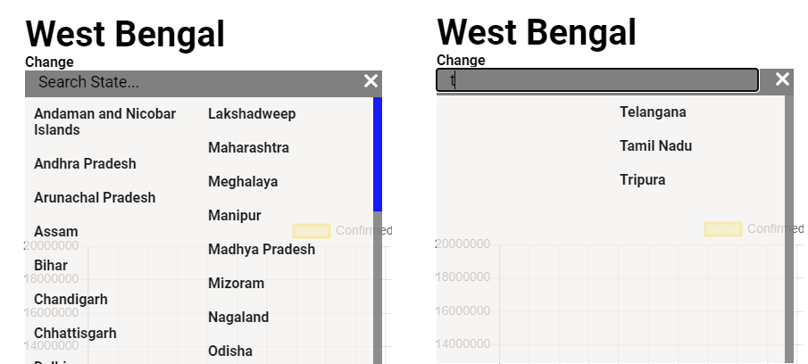

# Covid-19 Tracker

## Title Page

## Certificate from the Supervisor

## Acknowledgement

We would like to thank our Project Guide NS Ma'am for her whole-hearted support in making this project. Her insights gave us new perspectives and ideas to make our project faster, robust and beautiful.

We are very much thankful to our past selves for enduring the hurdles in learning to code in HTML, CSS, JavaScript with patience, persistence and perseverance. Thank you for never giving up. Although there might be many bugs left, we can cut you off some slack and do the rest.

## Table of Contents

## Abstract

This project focuses on building a covid-19 tracker website that helps to visualize the large number of people affected, deceased and recovered due to the virus on a daily basis across the states in India.

It uses different API to fetch data from the servers and displays it on the website in the form of cards, charts and maps.

The main purpose of this website is to create awareness among people, to give them a simplistic view of data and to provide useful resources.

## Introduction (Domain Description, Motivation and Scope of the Work)

### Domain Description

This is a frontend web application to visualize Covid-19 data and statistics in India.
It is made using HTML, CSS and Javascript.

### Motivation

We have come across many websites displaying Covid-19 statistics but we weren’t satisfied with the way it was visualized. We felt that it should be easier to understand and should be visually appealing.

One other factor that makes our project different is that Volunteers and Organizations can register with us and their contact details will be there on our website for people needing help in this pandemic situation.

### Scope of the Work

As with Covid-19 data, this project can be used to visualize any kind of data in a much simpler and beautiful way. It can be applied to visualize Financial data, Scientific data, etc.

## Background/Review of Related Work

### Websites

#### The following websites were the one from where we took our inspiration

1. covid19india.org

  This is a website built using React.js and has their own REST API.

## Methodology (Problem Formulation, Algorithm Description, and other Design descriptions)

### Problem Formulation

The problem that is being faced by all of us during this pandemic is the lack of available resources such as availability of beds in hospitals, location of Covid hospitals, accurate statistics and contact details of Volunteer Organizations and Individuals. We are set out to bridge the gap between those who needs these resources and those who can provide.

By using our platform, Users can get daily accurate statistics of confirmed cases, deaths and recovered cases on a state-level as well as can seek help thanks to volunteer organizations and individuals across India. Volunteer Organizations and Individuals can register themselves through our platform so that other users in need can seek their help.

### Algorithm Description

#### Algorithm used in drawing the Growth Rate Chart

The following formula has been used to generate Daily Growth Rate graph:

$$PR = {\frac {(V_{present} - V_{past})} {V_{past}} * 100}$$

$$PR = \text{Percent Rate}$$

$$V_{present} = \text{Present Value}$$

$$V_{past} = \text{Past Value}$$

#### Algorithm used in drawing the Recovery Rate and Death RateChart

The following formula has been used to generate Recovery Rate and Death Rate graph :

$$GrowthRate = {\frac {Recovered} {Confirmed} * 100}$$

$$DeathRate = {\frac {Deceased} {Confirmed} * 100}$$

### Design

### Technologies Used

- HTML
- CSS
- JavaScript
- Firebase

#### HTML

The HyperText Markup Language, or HTML is the standard markup language for documents designed to be displayed in a web browser. It can be assisted by technologies such as Cascading Style Sheets (CSS) and scripting languages such as JavaScript.

Web browsers receive HTML documents from a web server or from local storage and render the documents into multimedia web pages. HTML describes the structure of a web page semantically and originally included cues for the appearance of the document.

#### CSS

Cascading Style Sheets (CSS) is a style sheet language used for describing the presentation of a document written in a markup language such as HTML. CSS is a cornerstone technology of the World Wide Web, alongside HTML and JavaScript. CSS is designed to enable the separation of presentation and content, including layout, colors, and fonts.

#### JavaScript

JavaScript, often abbreviated as JS, is a programming language that conforms to the ECMAScript specification. JavaScript is high-level, often just-in-time compiled, and multi-paradigm. It has curly-bracket syntax, dynamic typing, prototype-based object-orientation, and first-class functions.

#### Firebase

Firebase (a NoSQLjSON database) is a real-time database that allows storing a list of objects in the form of a tree. We can synchronize data between different devices. Firebase manages real-time data in the database. So, it easily and quickly exchanges the data to and from the database. Hence, for developing mobile apps such as live streaming, chat messaging, etc., we can use Firebase.

### Additional Libraries Used

- Google Fonts

  This is a library of Free and Open Source Fonts available to use in any project. This is helpful because most of the time the browser gives some fonts which can be different in other browsers or platforms. Google Fonts enables us to use a consistent typography across all browsers and platforms.

- Animate on Scroll

  This is a library containing beautiful scroll animations. This gives the webpage a nice look and feel when you scroll through it. It is implemented just by importing the library in the HTML file and adding the animation name as an attribute to any HTML element.

- Normalize.css

  This is a CSS Reset File. To explain in simpler terms, every browser has some defaults styles to each and every HTML element and it differs from browser to browser. So, to have a consistent default styles across all browsers *Normalize.css* is used. It makes the webpage look same across all browsers and platforms.

- geoPlugin

  This is a web service that returns the location of the client. We are using this service to determine from which state our webpage is being accessed and we can show the data pertaining to that state. Thus freeing the client of the hassle of searching their state.

- Moment.js

  This is a library which contains many functions related to Date and Time. We are using the functions provided by this library to format dates into its easily recognizable counterparts in our graphs.

- Chart.js

  This is the library we are heavily relying on to display our graphs. Rather creating the graphs from scratch, this library provides us with templates of many popular graphs like Line Chart, Pie Chart, Bar Chart, etc. We are just giving the data to the library and it's many functions and it renders the chart according to the provided data.

- SweetAlert.js

  This is a library containing templates for acknowledgement after a form has been submitted.

### Data Sources

- [Ministry of Health and Family Welfare, Government of India](https://www.mohfw.gov.in/)

- [MyGov.in](https://www.mygov.in/covid-19/)

- [Covid19India.org](https://covid19india.org/)

- [IndiaCovid-19.in](https://indiacovid-19.in/)

## Implementation

### DFD


### Implementation of the Card Component

The cards component:


```js
async function fetchData() {
  await fetch("https://api.covid19api.com/summary")
    .then((response) => {
      return response.json();
    })
    .then((data) => {
      "Displays the data fetched from the API in the website if the promise is resolved"
    })
    .catch((err) => {
      "Displays error if the promise is rejected"
    });
}
```

- The fetchData() is an asynchronous function that fetches data from the API and displays it into the website.

- The await fetch("https://api.covid19api.com/summary") starts a request to "https://api.covid19api.com/summary" and returns a promise.

- A promise has two states: either it will be fulfilled(i.e. resolved) or it will be failed(i.e. rejected).

- The await keyword is present, so the asynchronous function is paused until the request completes.

- When the request completes, response is assigned with the response object of the request.

- response.json() is a method on the response object that let's us extract a JSON(JavaScript Object Notation) object from the response.

- .then(data) is called when the promise is resolved.

- .catch(err) is called when the promise is rejected in case a request cannot be made or a response cannot be retrieved.

### Implementation of the Line Chart


The line chart is used to show the comparison among the data sets(i.e The Total Confirmed Cases, Total Recovered and Total Deaths) across the country over the past months.

- Dataset Properties
  
  data.datasets [index] - The line chart allows a number of properties to be specified for each dataset. These are used to set display properties for a specific dataset.
  
  - backgroundColor - The line fill color.
  - borderColor - The line color.
  - fill - Fills the area under the line.
  - label - To give names to the lines used for      comparison.
  - data - Used to pass data in the form of array.

  data.labels - Used to label the index axis(i.e. by default the x-axis.)

  data.options - Provides options for the whole chart.
  
  - responsive - Resizes the chart according to the window size.
  - maintainAspectRatio - Determines whether to maintain the original canvas aspect ratio(width/height) when resizing.

### Search State and Dropdown box



- The states displayed in the dropdown box, are taken from  a stateList[] array that contains all the 28 states and 7 union territories of India, and are divided into 2 lists.

```js
input.addEventListener("input", function () {
  let value = input.value.toUpperCase();

  stateList.forEach((state) => {
    if (state.name.toUpperCase().startsWith(value)) {
      document.getElementById(state.name).classList.remove("hide");
    } else {
      document.getElementById(state.name).classList.add("hide");
    }
  });
});
```

- The "input" event changes whenever any user searches any state.
- Then a forEach() method is used to loop over all the states in the stateList[] array.
- The input value that the user has typed is compared with the states here.
- If a match is found, then the corresponding states will be displayed in the dropdown box.

### Helpline Page

- Contact Information - This page, displays the helpline numbers of every state across India, in a tabular format, that people can reach out to in need.

- Testing Centres - This page provides the names as well as the links of all the hospitals in a state where the RT-PCR test can be done.

- Resources - This page provides all the available links of websites which renders valuable information about availability of beds, plasmas, oxygen cylinders and many more.

### Awareness Page

This page focuses on creating awareness among people by portraying the preventive measures and further highlighting the DO's and DON'Ts during this pandemic.

## Results and Discussion

## Conclusion

This project aims to display the accurate real-time statistics of COVID-19 pandemic and spread awareness among people. There are several other websites that serves the similar purpose as this project but the unique factor of our website is that any Organization or any individual can add useful resources in our website by registering with us.

In future, we may extend our website to include features such as:

- Newsletter - On subscribing, users will receive a daily mail about the latest data statistics.

## References
